# 大型程式碼倉庫中 LLM 自動化代碼修改技術：圖解版研究報告

> 基於 **86 篇** ArXiv 論文（2023–2026）之研究成果彙整
> 合併來源：博特一號（33 篇分析報告）+ 博特二號（28 篇執行方案 + 31 篇補充搜索），去重後共計 86 篇
> 撰寫日期：2026-02-01 ｜ 圖解版：2025-07-14
> 目標讀者：想要**建構**此類系統的工程團隊

---

## 摘要 (Executive Summary)

本報告基於 86 篇 2023–2026 年 arXiv 論文，系統性分析了在大型程式碼倉庫（Repository-level）中利用 LLM 進行自動化代碼修改、除蟲、安全漏洞修補與 CI/CD 自動修復的技術現狀。

**核心發現：**

1. **倉庫級任務仍是巨大挑戰**：從函數級到倉庫級，LLM 表現大幅下降（GPT-3.5 從 ~50%+ 降至 22.58%）。即使最先進系統（Kimi-Dev）在 SWE-bench Verified 也僅達 60.4%。
2. **Agentless 與 Agent 趨於融合**：簡單工作流（Agentless，$0.70/issue，32% 解決率）和複雜 Agent 系統各有優勢。Kimi-Dev 證明兩者可互補——Agentless 訓練產生的技能先驗有助 Agent 適應。
3. **定位是瓶頸中的瓶頸**：RGFL 將檔案級 Hit@1 從 71.4% 提升至 85%，帶來 12.8% 端到端修復提升。精確定位是有效修復的前提。
4. **上下文管理成為核心議題**：CAT 工具化上下文達 57.6% SWE-bench Verified 解決率；SWE-Pruner 節省 23-54% token 且幾乎不影響效能。
5. **SWE-Bench+ 揭示真相**：過濾 solution leakage（32.67%）和 weak tests（31.08%）後，真實解決率僅 3.97%，業界表現被嚴重高估。
6. **工業部署仍稀少**：僅 Google（bug reproduction）、字節跳動（ContextCRBench 程式碼審查）、Kodezi（debugging-first LM）、騰訊（LLM 降低 SAST 誤報）有明確的工業規模部署報告。
7. **LLM + 靜態分析整合前景明確**：KNighter 在 Linux kernel 發現 30 個 CVE；IRIS 將 CodeQL 檢測從 27→55/120；騰訊實證誤報降 94-98%，成本僅 $0.001-0.12/告警。
8. **安全漏洞自動修補仍有巨大改進空間**：PatchIsland 在 AIxCC 達 72.1%，VulnResolver 在 SEC-bench 達 75%，但 VulnRepairEval exploit-based 評估最佳僅 21.7%，APR 對抗攻擊成功率達 0.91。
9. **CI/CD 管線自動修復逐漸成熟**：GradleFixer Android 構建修復 81.4%，IaCGen 部署成功率 54.6-91.6%（FSE'26），CI/CD 配置翻譯成功率 75.5%。

**建議執行策略**：採用**分層混合架構（Layered Hybrid Architecture）**——80% 簡單問題走 Agentless Fast Path，20% 複雜問題升級至 Multi-Agent 系統。分四階段、12 個月內完成部署，**第四階段加入靜態分析整合與安全驗證層**。

---

## 一、論文總覽

### 1.1 論文統計

本報告合併兩份獨立研究報告及補充搜索，去重後共收錄 **86 篇**唯一論文：

| 來源 | 原始收錄 | 共享論文 | 獨有論文 |
|------|---------|---------|---------|
| 博特一號 | 33 篇（表中 40 行，含跨類別重複） | 15 篇 | ~25 篇 |
| 博特二號 | 28 篇（含 32 篇附錄） | 15 篇 | ~17 篇 |
| 補充搜索（三大缺口領域） | 31 篇 | 0 篇 | 31 篇 |
| **合併去重** | — | — | **~86 篇** |

### 1.2 分類統計

| 類別 | 篇數 | 代表論文 |
|------|------|---------|
| 🐛 自動化缺陷修復 / 除蟲 | 12 | Agentless, REFINE, RGFL, Kimi-Dev, SemAgent, HAFixAgent |
| 🤖 SWE 智能代理 | 10 | SWE-agent, HyperAgent, BOAD, CAT, daVinci-Dev, FuseSearch |
| 📐 基準測試與評估框架 | 12 | SWE-bench, SWE-Bench+, SWE-Bench++, RepoDebug, Breakpoint |
| 🔍 程式碼審查自動化 | 3 | AACR-Bench, ContextCRBench, CodeFuse-CR-Bench |
| 🧠 倉庫級程式碼理解與檢索 | 10 | RIG, AlignCoder, RepoShapley, CodeMEM, InlineCoder, RepoLens |
| 🔄 大規模程式碼遷移 | 4 | MigrationBench, FreshBrew, C-to-Rust, Advancing Validation |
| 🎯 故障定位專項 | 4 | RGFL, Reformulate-Retrieve-Localize, NL-Summarization, InfCode-C++ |
| 📊 綜述與其他 | ~3 | LLM Issue Resolution Survey, GPT-4 Refactoring |
| 🔐 LLM + 靜態分析整合 | 12 | KNighter, IRIS, SAST-Genius, 騰訊誤報研究, BugLens, QLCoder |
| 🛡️ 自動化安全漏洞修補 | 10 | PatchIsland, VulnResolver, VulnRepairEval, Vul-R2, RvB |
| 🔄 CI/CD 管線自動修復 | 10 | GradleFixer, IaCGen, Build-bench, MACOG, AIOpsLab |

---

## 二、建議執行方案

### 2.1 整體架構：分層混合架構（Layered Hybrid Architecture）

根據論文研究的兩大流派——**Agentless 工作流**與 **Agentic 多代理系統**——以及 Kimi-Dev 所揭示的「兩者可互補」之洞見，建議採用分層混合架構：

**📐 技術架構圖：**
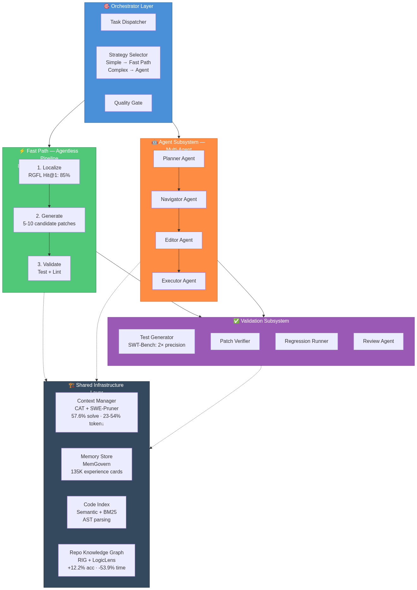

**🎨 AI 視覺化：**
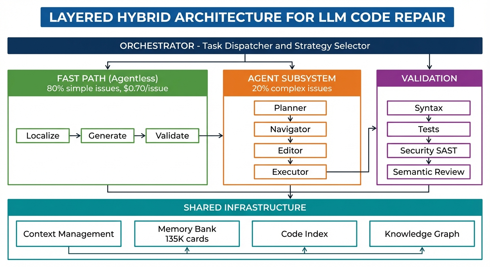

> **圖 1：分層混合架構（Layered Hybrid Architecture）**
> 系統分為五層：最上層的 **Orchestrator** 負責任務分發與策略選擇；中間層分為三條路徑——**Fast Path**（Agentless Pipeline）處理 80% 簡單問題（$0.70/issue），**Agent Subsystem** 升級處理 20% 複雜跨檔案問題，**Validation Subsystem** 提供四層驗證；底層的 **Shared Infrastructure** 包含上下文管理（CAT+SWE-Pruner）、記憶庫（MemGovern 135K 經驗卡）、程式碼索引（語意+BM25）及知識圖譜（RIG/LogicLens），為所有路徑共享。

**設計理念：**
- **Fast Path（Agentless Pipeline）**：80% 以上的簡單到中等 Bug 走三階段流水線（定位→修復→驗證），高效低成本。
- **Agent Subsystem（升級路徑）**：當 Fast Path 置信度低或驗證失敗時，升級至多代理協作系統處理跨檔案、複雜邏輯的 Bug。
- **Shared Infrastructure**：上下文管理（CAT + SWE-Pruner）、經驗記憶（MemGovern）、程式碼索引（AST + 語意檢索）、知識圖譜（RIG / LogicLens）被兩條路徑共享。

### 2.2 六階段處理流程

**📐 技術架構圖：**
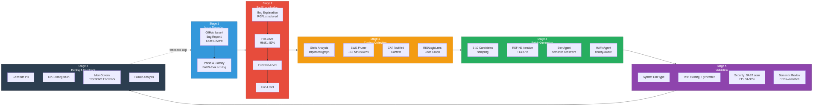

**🎨 AI 視覺化：**
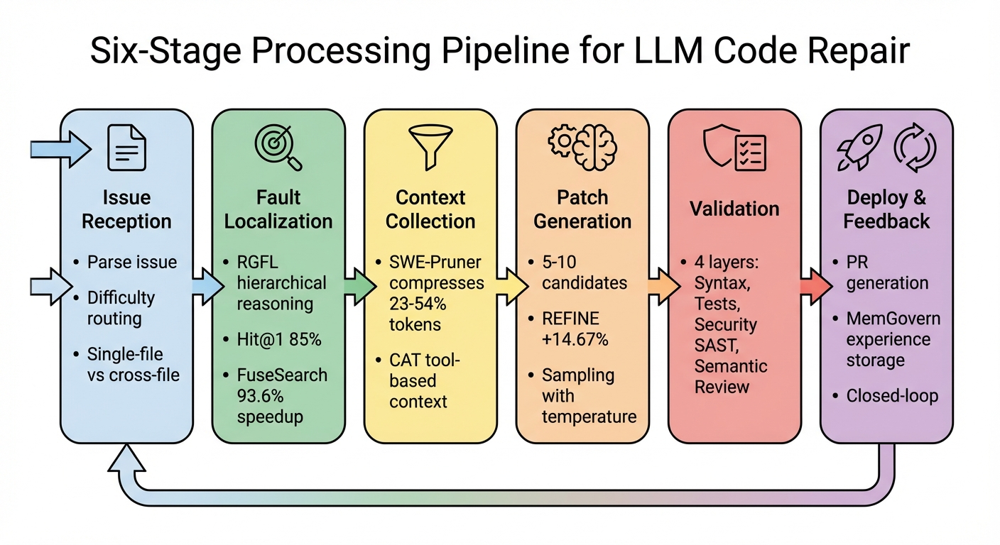

> **圖 2：六階段處理流程（Six-Stage Processing Pipeline）**
> 完整修復流程從 **問題接收**（Issue 解析+難度分流）開始，經 **故障定位**（RGFL 分層推理，Hit@1 85%）、**上下文收集**（SWE-Pruner 壓縮 23-54% token）、**修復生成**（5-10 候選 + REFINE 精煉 +14.67%）、**驗證**（語法/測試/安全/語意四層），到 **部署回饋**（PR 生成 + MemGovern 經驗回存）。整個流程形成閉環，失敗案例的回饋持續改進系統。

#### 階段 1：問題接收與分類

| 輸入 | 處理 | 路由策略 |
|------|------|---------|
| GitHub Issue / Bug Report / Code Review 回饋 | Issue 結構化解析 + 難度預估 | 單檔案 + 明確堆疊追蹤 → Fast Path |
| | 萃取錯誤訊息、堆疊追蹤、預期行為 | 跨檔案 + 語意模糊 + 涉及架構 → Agent Path |
| | 參考 FAUN-Eval 細粒度評估 | QA/定位/編輯三子任務預估難度分流 |

#### 階段 2：故障定位（Fault Localization）

```
Issue Description
    │
    ▼
[Bug Explanation Generator]  ← RGFL：生成結構化 Bug 解釋
    │
    ▼
[Repository-Level Localizer] ← 檔案級排序（Top-K Files）
    │
    ▼
[Function-Level Localizer]   ← 函數/方法級定位
    │
    ▼
[Line-Level Localizer]       ← 精確行級定位
```

**並行加速**：FuseSearch 多路搜索（grep、語意搜索、AST 結構搜索），加速 93.6%。
**輔助手段**：RepoLens 概念知識抽取 + Time Travel（Git Bisect + LLM）用於回歸 Bug。

#### 階段 3：上下文收集（Context Extraction）

1. **靜態分析層**：import/include 依賴、呼叫圖上下游、型別定義、相關測試
2. **動態壓縮層（SWE-Pruner）**：0.6B 參數輕量級神經略讀器，縮減 23-54% token
3. **CAT 上下文工具化**：Agent 可隨時呼叫的上下文獲取/釋放工具
4. **RIG / LogicLens**：確定性程式碼圖譜，提供 LLM-friendly JSON view

#### 階段 4：修復生成（Patch Generation）

1. **候選生成**：LLM 生成 5-10 個候選補丁（sampling with temperature）
2. **REFINE 精煉**：識別「近似正確」補丁，用上下文感知修正 prompt 迭代精煉
3. **語義約束**：SemAgent 利用 program semantics 減少 hallucination
4. **歷史感知**：HAFixAgent mining commit patterns 指導修復
5. **多檔案協調**：HyperAgent 的 Planner-Navigator-Editor 模式

#### 階段 5：驗證（Validation）

**四層驗證機制：**
1. **語法驗證**：Lint / 型別檢查 / 編譯驗證
2. **測試驗證**：現有測試 + LLM 生成針對性測試（SWT-Bench 策略） + 回歸測試
3. **安全驗證**：SAST 掃描（CodeQL/Semgrep）+ LLM 誤報過濾（騰訊方法，誤報降 94-98%）+ exploit-based 驗證（VulnRepairEval 思路）
4. **語意審查**：LLM 程式碼審查（ContextCRBench hunk 級評估） + 交叉驗證

#### 階段 6：部署與回饋

1. 生成 Pull Request（含變更說明、影響範圍分析）
2. 整合至 CI/CD Pipeline
3. 收集結果回饋至 MemGovern 經驗記憶庫
4. 失敗案例分析並更新策略

### 2.3 建議技術選型

| 環節 | 推薦方案 | 備選 | 理由 |
|------|---------|------|------|
| **主力 LLM** | Claude Sonnet 4 / GPT-4o | DeepSeek-V3, Qwen-72B | 閉源在 SWE-bench 表現最佳；開源可控成本 |
| **專用定位模型** | FuseSearch-4B (Fine-tuned) | RGFL prompt | 小模型專用定位，速度快、成本低 |
| **上下文壓縮** | SWE-Pruner (0.6B) | CAT framework | 輕量、可離線部署、token 節省顯著 |
| **程式碼圖譜** | Tree-sitter AST + Neo4j/NetworkX | LSP servers, Sourcegraph | 多粒度索引支援結構化和語意搜索 |
| **RAG 檢索** | RL-trained retriever (AlignCoder style) | BM25 + reranker | EM +18.1%，跨語言泛化性強 |
| **經驗記憶** | MemGovern 風格經驗卡 | RAG + Vector DB | 結構化經驗可直接注入 prompt |
| **測試生成** | LLM + SWT-Bench 方法 | 傳統 fuzzing | Issue→測試案例的形式化有實驗支撐 |
| **Agent 框架** | 自建（基於 HyperAgent 架構） | SWE-Agent, OpenHands, LangGraph | 自建才能深度整合各模組 |
| **RL 訓練** | PPO/GRPO on SWE-bench data | DPO on curated pairs | Self-play SWE-RL 驗證可行 |
| **沙盒執行** | Docker container per task | Modal, Firecracker | 隔離性、可重現性 |

---

## 三、關鍵技術點

### 3.1 Fault Localization（故障定位）

故障定位是整個 Pipeline 的**瓶頸**。在百萬行級倉庫中，需要從數千個檔案中精確找到關鍵的幾行程式碼。

**📐 技術架構圖：**
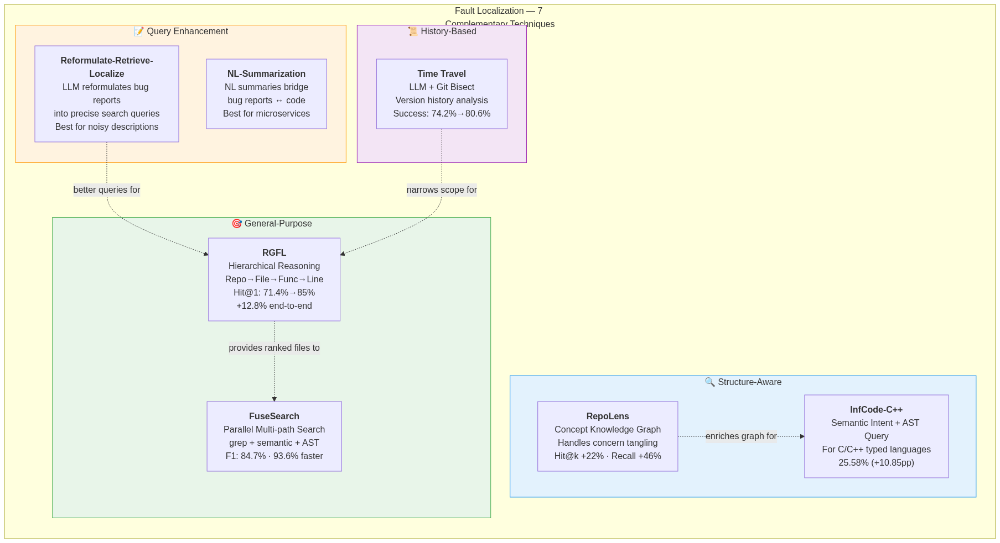

**🎨 AI 視覺化：**
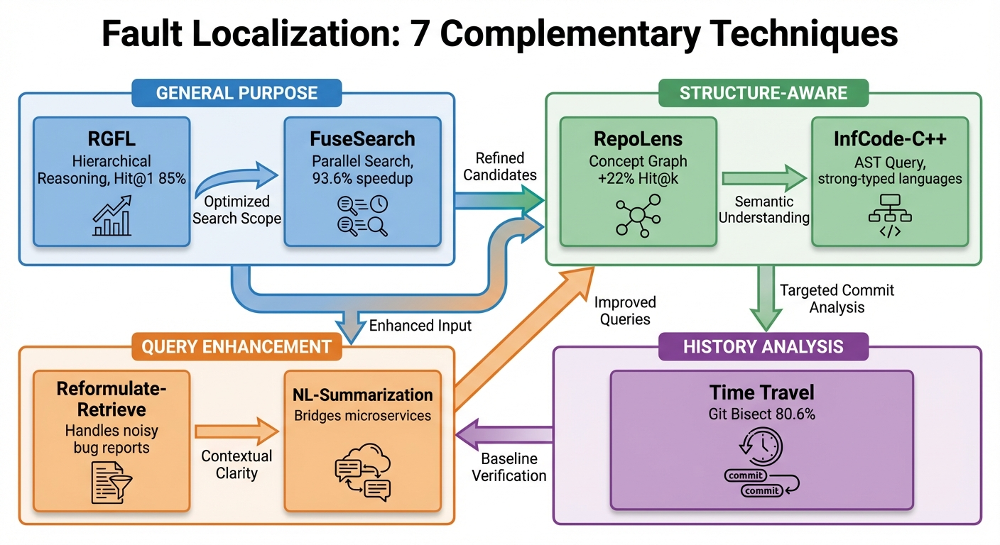

> **圖 3：故障定位技術互補關係**
> 七種定位技術分為四大類：**通用型**（RGFL 分層推理 Hit@1 85%、FuseSearch 並行搜索加速 93.6%）、**結構感知**（RepoLens 概念圖 +22% Hit@k、InfCode-C++ AST 查詢適用強型別語言）、**查詢增強**（Reformulate-Retrieve 處理嘈雜 Bug 描述、NL-Summarization 橋接微服務）、**歷史分析**（Time Travel Git Bisect 80.6%）。箭頭顯示技術間的互補流：查詢增強為 RGFL 提供更精確的輸入，RepoLens 豐富 InfCode-C++ 的搜索圖，Time Travel 為 RGFL 縮小搜索範圍。

**核心技術方案：**

| # | 技術 | 方法描述 | 適用場景 |
|---|------|---------|---------|
| 1 | **RGFL 分層推理** | LLM 生成結構化 Bug 解釋 → Repo→File→Function→Line 逐步縮小 | 通用 Bug |
| 2 | **FuseSearch 並行定位** | 多路並行搜索（grep + 語意 + AST），RL 策略決定搜索深度 | 大型倉庫加速 |
| 3 | **RepoLens 概念知識圖** | 處理 concern tangling/scattering，概念層級的知識表示 | 複雜架構 |
| 4 | **InfCode-C++ AST 結構化** | 語意意圖檢索 + 確定性 AST 查詢 | C/C++ 強型別語言 |
| 5 | **Reformulate-Retrieve-Localize** | LLM reformulate bug report 為精確搜索查詢 | Noisy bug descriptions |
| 6 | **NL-Summarization 跨 Repo** | LLM NL summaries 橋接 bug reports 和 code | 微服務架構 |
| 7 | **Time Travel** | LLM + Git Bisect 整合版本歷史定位 | 回歸 Bug |

**📊 效能數據：**

| 技術 | 指標 | 數據 | 來源 |
|------|------|------|------|
| RGFL | 檔案級 Hit@1 | 71.4% → **85%**（+13.6pp） | [2601.18044] |
| RGFL | 端到端修復提升 | **+12.8%**（整合 Agentless） | [2601.18044] |
| FuseSearch-4B | 檔案級 F1 | **84.7%**（SOTA） | [2601.19568] |
| FuseSearch-4B | 搜索加速 | **93.6%** 加速，減少 67.7% 輪次 | [2601.19568] |
| RepoLens | Hit@k 提升 | 平均 **+22%** | [2509.21427] |
| RepoLens | Recall@k 提升 | 平均 **+46%** | [2509.21427] |
| Time Travel | Git Bisect 成功率 | 74.2% → **80.6%** | [2511.18854] |

---

### 3.2 Context Extraction（上下文提取）

大型倉庫的程式碼量遠超 LLM 上下文窗口。關鍵在於精確提取與任務最相關的上下文片段。

**📐 技術架構圖：**
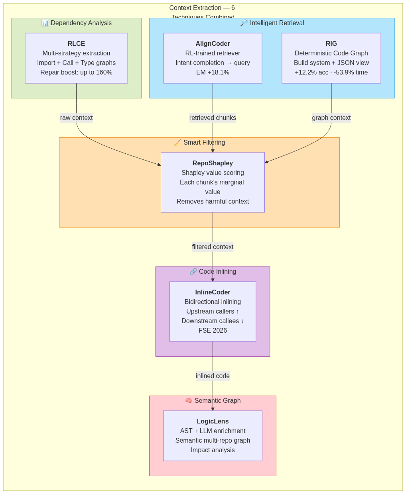

**🎨 AI 視覺化：**
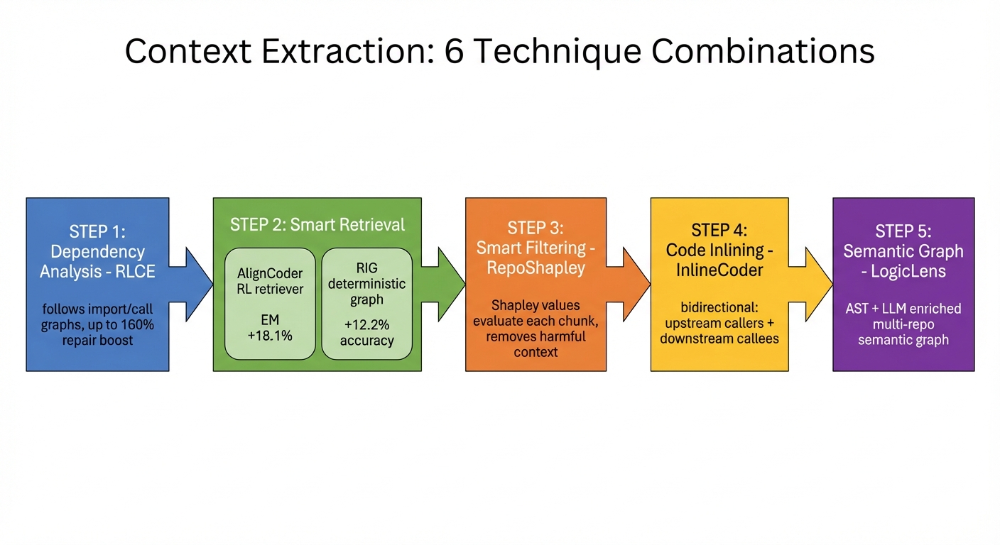

> **圖 4：上下文提取技術方案組合**
> 六種技術形成處理流水線：**依賴分析**（RLCE 沿依賴圖擴展，修復提升最高 160%）→ **智慧檢索**（AlignCoder RL 訓練的檢索器 EM +18.1%、RIG 確定性圖譜 +12.2% 準確率）→ **智慧過濾**（RepoShapley 用 Shapley 值評估每個代碼段的邊際貢獻，移除有害上下文）→ **代碼內聯**（InlineCoder 雙向內聯上下游呼叫）→ **語義圖譜**（LogicLens AST+LLM 增強的多倉庫語義圖）。

**核心技術方案：**

| # | 技術 | 方法描述 |
|---|------|---------|
| 1 | **RLCE 多策略提取** | Import graph + call graph + type hierarchy，沿依賴圖向外擴展 |
| 2 | **AlignCoder 查詢增強** | LLM 補全意圖→檢索查詢，RL-trained retriever 對齊意圖 |
| 3 | **RIG 確定性圖譜** | Build system 解析 + LLM-friendly JSON view，多語言 repo 效果最佳 |
| 4 | **RepoShapley 過濾** | Shapley values 評估每個 chunk 邊際貢獻，過濾有害 context |
| 5 | **InlineCoder 雙向內聯** | Upstream inlining（callers）+ Downstream retrieval（callees） |
| 6 | **LogicLens 語義圖** | AST parsing + LLM enrichment → semantic multi-repo graph |

**📊 效能數據：**

| 技術 | 指標 | 數據 | 來源 |
|------|------|------|------|
| RLCE | 修復能力提升 | 最高 **160%** | RepoBugs [2403.00448] |
| RLCE | 基線（GPT-3.5 無策略） | 僅 **22.58%** | RepoBugs [2403.00448] |
| AlignCoder | EM 分數提升 | **+18.1%**（CrossCodeEval） | [2601.19697] |
| RIG | 準確率提升 / 時間縮短 | **+12.2%** / **-53.9%** | RIG（一號報告） |
| RIG | 多語言 repo | **+17.7%** 準確率 / **-69.5%** 時間 | RIG（一號報告） |
| AACR-Bench | 缺陷覆蓋率 | 提升 **285%**（AI 輔助標注） | [2601.19494] |
| CodeMEM | 指令遵循 / 交互輪數 | **+12.2%** / **-2~3 輪** | CodeMEM（一號報告） |

---

### 3.3 Context Management（上下文管理）

使系統能處理真正大型倉庫（百萬行以上）的關鍵技術。

**📐 技術架構圖：**
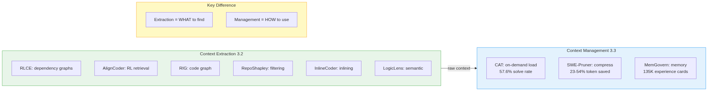

**🎨 AI 視覺化：**
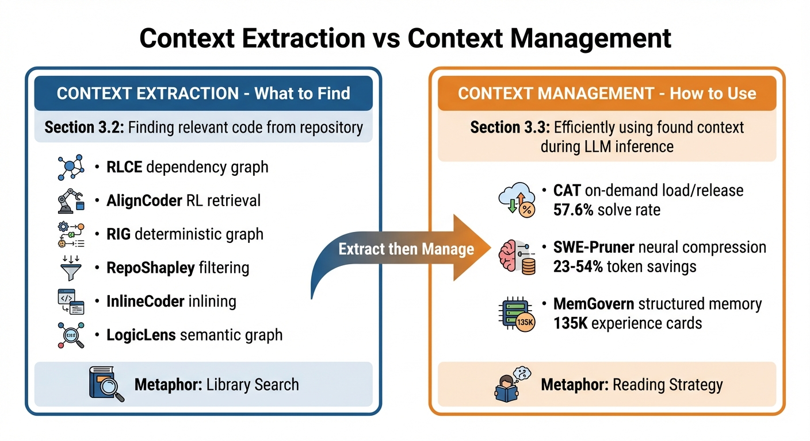

> **圖 5：Context Extraction vs Context Management 核心差異**
> **上下文提取**（3.2 節）解決的是「找什麼」——從倉庫中找到相關代碼片段，包含 RLCE 依賴圖遍歷、AlignCoder RL 檢索、RIG 確定性圖譜等六種技術。**上下文管理**（3.3 節）解決的是「怎麼用」——在 LLM 推理過程中有效利用已找到的上下文，包含 CAT 按需載入/釋放（57.6% 解決率）、SWE-Pruner 神經壓縮（23-54% token 節省）、MemGovern 結構化經驗記憶（135K 經驗卡）。簡言之：提取 ≈ 圖書館搜索，管理 ≈ 閱讀策略。

**核心技術方案：**

| # | 技術 | 方法描述 |
|---|------|---------|
| 1 | **CAT（Context as a Tool）** | 上下文維護提升為 Agent 可呼叫的工具，避免一次性載入導致注意力稀釋 |
| 2 | **SWE-Pruner 神經略讀器** | 0.6B 參數輕量級模型，逐檔案動態選擇相關程式碼行 |
| 3 | **MemGovern 經驗記憶** | 將修復經驗結構化為記憶卡，類似問題可直接引用 |

**📊 效能數據：**

| 技術 | 指標 | 數據 | 來源 |
|------|------|------|------|
| CAT (SWE-Compressor) | SWE-Bench Verified | **57.6%** 解決率 | [2512.22087] |
| SWE-Pruner | Token 縮減 | **23-54%**（效能影響極小） | [2601.16746] |
| MemGovern | SWE-Bench Verified 提升 | **+4.65%**（插件式） | [2601.06789] |
| MemGovern | 經驗卡規模 | **135K** 經驗卡 | [2601.06789] |

---

### 3.4 Patch Generation（修復生成）

**📐 技術架構圖：**
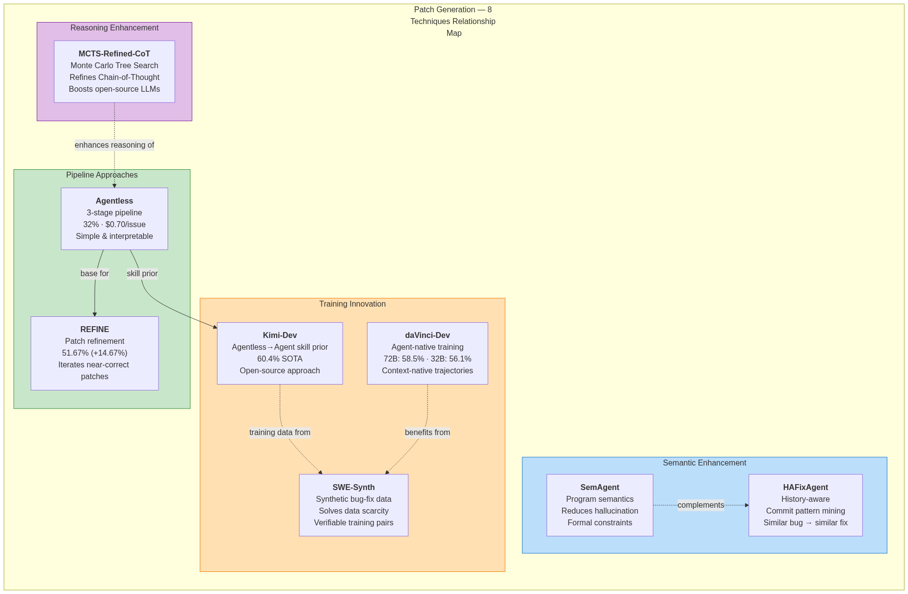

**🎨 AI 視覺化：**
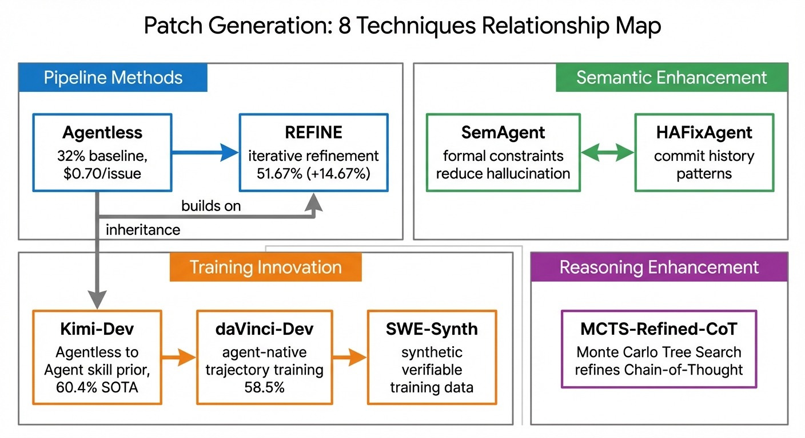

> **圖 6：Patch Generation 八種技術關係圖**
> 八種技術分四個象限：**Pipeline 方法**——Agentless 提供 32% 基線（$0.70/issue），REFINE 在其上迭代精煉至 51.67%（+14.67%）；**語義增強**——SemAgent 用形式化約束減少幻覺，HAFixAgent 挖掘 commit 歷史模式互補；**訓練創新**——Kimi-Dev 將 Agentless 訓練轉化為 Agent 技能先驗達 60.4% SOTA，daVinci-Dev 用 Agent 原生軌跡訓練達 58.5%，SWE-Synth 合成可驗證訓練資料解決數據稀缺；**推理增強**——MCTS-Refined-CoT 用蒙特卡洛樹搜索精煉思維鏈。箭頭顯示關鍵技術繼承關係。

**核心技術方案：**

| # | 技術 | 方法描述 |
|---|------|---------|
| 1 | **Agentless 三階段** | 定位→多候選 patch→測試過濾，簡單可解釋 |
| 2 | **REFINE 補丁精煉** | 識別「近似正確」補丁，LLM 審查迭代修正 |
| 3 | **SemAgent 語義感知** | 利用 program semantics 約束生成，減少 hallucination |
| 4 | **HAFixAgent 歷史感知** | Mining commit patterns 指導相似 Bug 修復 |
| 5 | **Kimi-Dev 技能先驗** | Agentless 訓練→Agent 技能先驗，開源模型也能接近閉源 |
| 6 | **daVinci-Dev Agent 原生訓練** | Agent 原生資料（上下文原生 + 環境原生軌跡）中期訓練 |
| 7 | **MCTS-Refined-CoT** | Monte Carlo Tree Search 精煉 Chain-of-Thought 推理 |
| 8 | **SWE-Synth 合成資料** | 合成可驗證的 bug-fix 訓練資料，解決稀缺問題 |

**📊 效能數據：**

| 技術 | 基準 | 數據 | 來源 |
|------|------|------|------|
| Agentless | SWE-bench Lite | **32%** 解決率，成本 **$0.70** | [2407.01489] |
| REFINE + AutoCodeRover | SWE-bench Lite | **51.67%**（+14.67%） | [2510.03588] |
| Kimi-Dev | SWE-bench Verified | **60.4%**（工作流 SOTA） | [2509.23045] |
| daVinci-Dev 72B | SWE-bench Verified | **58.5%** | [2601.18418] |
| daVinci-Dev 32B | SWE-bench Verified | **56.1%** | [2601.18418] |
| Self-play SWE-RL | SWE-bench Verified 提升 | **+10.4 分** | [2512.18552] |
| SWE-agent | SWE-bench | **12.5%** pass@1（2024 突破性結果） | SWE-agent 論文 |

---

### 3.5 Validation / Testing（驗證與測試）

**核心技術方案：**

| # | 技術 | 方法描述 |
|---|------|---------|
| 1 | **SWT-Bench** | Issue 形式化為測試案例，作為補丁篩選器 |
| 2 | **MAVM 多步驗證** | 檢測→確認→修復→驗證的完整流水線 |
| 3 | **Google Bug Reproduction** | LLM agents 自動生成 reproduction tests（工業規模） |
| 4 | **AACR-Bench 多語言審查** | AI-assisted expert-verified，跨檔案上下文 code review |
| 5 | **交叉驗證** | 不同 LLM 互審，降低 hallucination 風險 |

**📊 效能數據：**

| 技術 | 指標 | 數據 | 來源 |
|------|------|------|------|
| SWT-Bench 測試生成 | SWE-Agent 精確度 | **翻倍** | [2406.12952] |
| MAVM | 真實漏洞修復 | **51 個**真實漏洞修復成功 | [2601.17762] |
| MAVM | 修復準確度 vs 基線 | **+31.9%-45.2%** | [2601.17762] |
| AACR-Bench | 缺陷覆蓋率 | **+285%** vs raw PR | [2601.19494] |
| ContextCRBench | 字節跳動部署 | 表現提升 **61.98%** | [2511.07017] |

---

### 3.6 Multi-file Coordination（多檔案協調）

**📐 技術架構圖：**
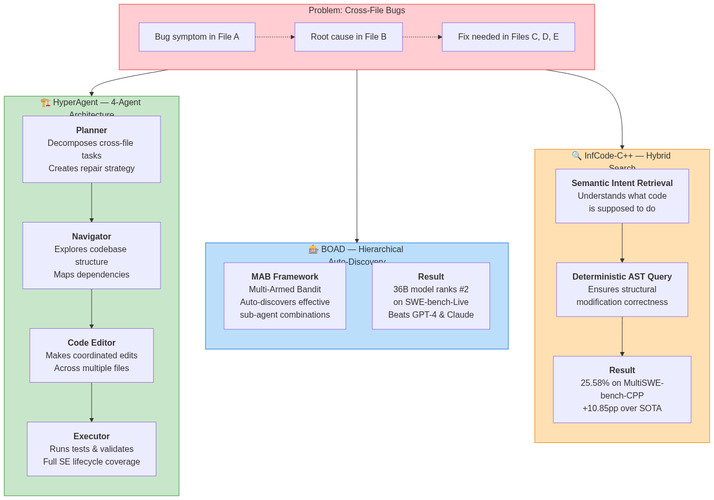

**🎨 AI 視覺化：**
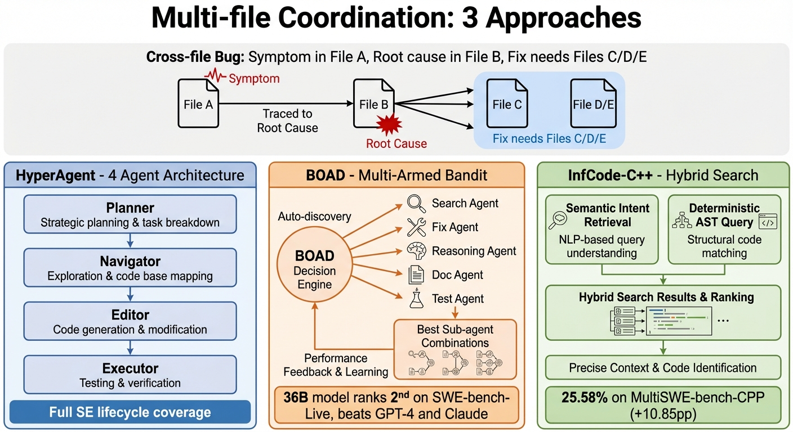

> **圖 7：多檔案協調三大方案詳解**
> 跨檔案 Bug 的核心問題：症狀在 File A，根因在 File B，修復需要動 Files C/D/E。三種方案各有側重：**HyperAgent** 用四代理架構（Planner 分解任務→Navigator 探索結構→Editor 協調修改→Executor 測試驗證）覆蓋完整 SE 生命週期；**BOAD** 用多臂老虎機框架自動發現最佳子代理組合，36B 模型在 SWE-bench-Live 排名第二，超越 GPT-4 與 Claude；**InfCode-C++** 結合語意意圖檢索與確定性 AST 查詢，在 MultiSWE-bench-CPP 達 25.58%（+10.85pp），專攻 C/C++ 強型別語言。

**核心技術方案：**

| # | 技術 | 方法描述 |
|---|------|---------|
| 1 | **HyperAgent 四代理架構** | Planner + Navigator + Code Editor + Executor |
| 2 | **BOAD 階層式自動發現** | MAB 框架自動發現有效子代理組合 |
| 3 | **InfCode-C++ 混合搜索** | 語意檢索 + AST 結構化查詢確保修改正確性 |

**📊 效能數據：**

| 技術 | 指標 | 數據 | 來源 |
|------|------|------|------|
| BOAD 36B | SWE-bench-Live 排名 | **第二**（超越 GPT-4, Claude） | [2512.23631] |
| InfCode-C++ | MultiSWE-bench-CPP | **25.58%**（+10.85pp over SOTA） | [2511.16005] |
| HyperAgent | 跨語言 SE 任務 | 完整 SE 生命週期覆蓋 | [2409.16299] |

---

### 3.7 🔐 LLM + 靜態分析整合（12 篇）

LLM 與傳統靜態分析工具（CodeQL、Semgrep、Infer 等）的整合，是近期最具工業落地潛力的方向之一。核心思路：用 LLM 增強靜態分析器的精確度、自動合成分析規則、大幅降低誤報。

**📐 技術架構圖：**
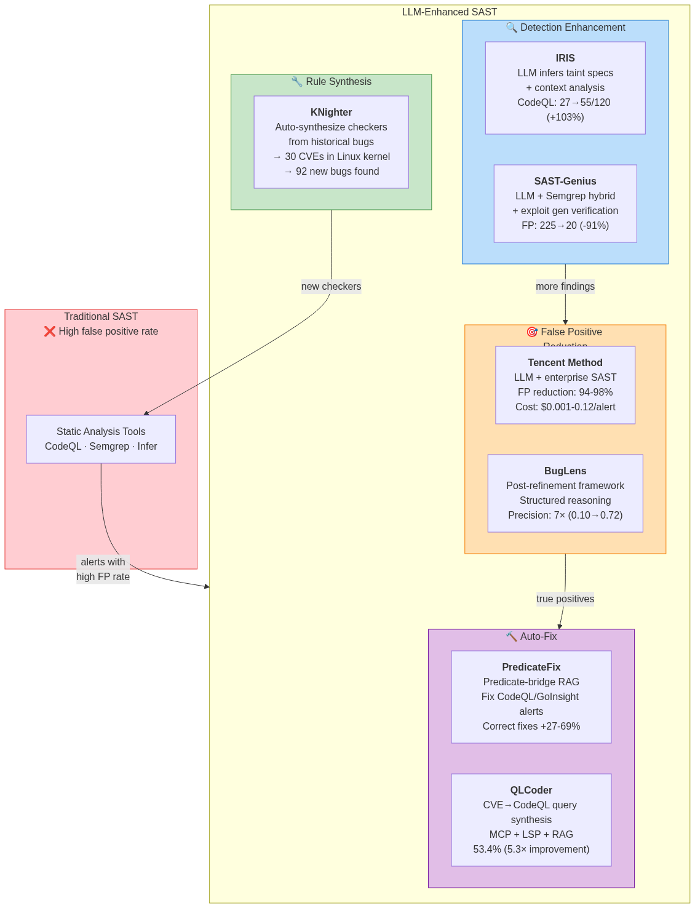

**🎨 AI 視覺化：**
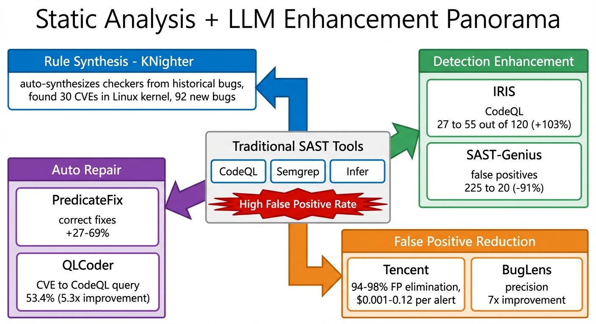

> **圖 8：靜態分析 + LLM 強化全景圖**
> 傳統 SAST 工具（CodeQL/Semgrep/Infer）最大痛點是高誤報率。LLM 在四個環節強化 SAST：**規則合成**——KNighter 從歷史 bug 自動合成 checker，在 Linux kernel 發現 30 個 CVE、92 個新 bug；**檢測增強**——IRIS 用 LLM 推斷 taint 規格使 CodeQL 從 27→55/120 (+103%)，SAST-Genius 混合框架誤報從 225→20 (-91%)；**誤報降低**——騰訊工業實證 94-98% 誤報消除、每條僅 $0.001-0.12，BugLens 精確度提升 7 倍；**自動修復**——PredicateFix 謂詞橋接 RAG 正確修復 +27-69%，QLCoder CVE→CodeQL 查詢合成 53.4%（5.3×改進）。

**核心技術方案：**

| # | 技術 | 方法描述 |
|---|------|---------|
| 1 | **KNighter** | LLM 從歷史 bug 模式自動合成靜態分析 checker，多階段合成 + 自動迭代精煉 |
| 2 | **IRIS** | LLM 推斷 taint 規格 + 上下文分析，增強 CodeQL 全倉庫漏洞檢測 |
| 3 | **SAST-Genius** | LLM + Semgrep 混合框架，含動態 bug 描述和 exploit 生成驗證 |
| 4 | **騰訊誤報研究** | 工業環境首次全面實證，LLM + SAT 消除 94-98% 誤報 |
| 5 | **BugLens** | 後精煉框架，結構化推理步驟評估安全影響，精確度提升 7 倍 |
| 6 | **PredicateFix** | 利用分析規則謂詞橋接告警與代碼，RAG 管線修復 CodeQL/GoInsight 告警 |
| 7 | **QLCoder** | 從 CVE 元數據自動合成 CodeQL 查詢，含 MCP + LSP + RAG |
| 8 | **AdaTaint** | 自適應 source/sink 推斷 + 神經符號推理過濾虛假告警 |
| 9 | **RAG + Multi-Tool 安全生成** | 編譯器 + CodeQL + KLEE 符號執行多工具迭代精煉 |
| 10 | **LLM Prompting as SA Proxy** | 研究 LLM 提示替代 CodeQL，對比思維鏈推理 |
| 11 | **LAMeD** | LLM 自動生成函數註解，改進記憶體洩漏檢測 |
| 12 | **BugScope** | 多代理系統模擬人類審計員學習 bug 模式 |

**📊 效能數據：**

| 技術 | 指標 | 數據 | 來源 |
|------|------|------|------|
| KNighter | Linux kernel 新 CVE | **30 個 CVE**，92 個新 bug | [2503.09002] SOSP'25 |
| IRIS (GPT-4) | CodeQL 漏洞檢測 | **27→55/120**（+103%） | [2405.17238] |
| SAST-Genius | 誤報降低（vs 純 Semgrep） | **~91%**（225→20） | [2509.15433] S&P'25 |
| 騰訊 | 誤報消除 / 成本 | **94-98%** / **$0.001-0.12**/告警 | [2601.18844] |
| BugLens | 精確度提升 | **7 倍**（0.10→0.72） | [2504.11711] |
| PredicateFix | 正確修復數增加 | **+27.1%-69.3%** | [2503.12205] ICSE'26 |
| QLCoder | CodeQL 查詢合成 | **53.4%**（純 Claude Code 僅 10%，5.3× 改進） | [2511.08462] |
| AdaTaint | 誤報降低 / 召回提升 | **-43.7%** / **+11.2%** | [2511.04023] |
| BugScope | 精確率 / 召回率 | **87.04%** / **90.00%**，發現 141 個未知 bug | [2507.15671] |
| RAG+Multi-Tool | 安全漏洞降低 | DeepSeek **-96%** 漏洞 | [2601.00509] |

**🏭 工業部署亮點：**
- **騰訊**：首個工業級 LLM+SAST 實證，每條告警 $0.001-0.12，相比人工審查（10-20 分鐘/條）節省數個數量級
- **KNighter**：Linux kernel 30 個 CVE，證明 LLM 合成 checker 可超越人工編寫的規則

---

### 3.8 🛡️ 自動化安全漏洞修補（10 篇）

LLM 用於 CVE 修復和安全漏洞自動修補，是自動化代碼修改的高風險高價值應用場景。

**核心技術方案：**

| # | 技術 | 方法描述 |
|---|------|---------|
| 1 | **PatchIsland** | 多樣 LLM 代理集成 + 兩階段補丁去重，面向持續模糊測試 |
| 2 | **VulnResolver** | 混合代理框架，CPCAgent 上下文預收集 + SPAAgent 安全屬性分析 |
| 3 | **Well Begun is Half Done** | 位置感知 + taint 語句覆蓋率評估補丁品質 |
| 4 | **Vul-R2** | 針對漏洞修復的推理 LLM + 強化學習自適應緩解 |
| 5 | **PATCHEVAL** | 多語言漏洞修補基準，1,000 漏洞 + 230 CVE 沙箱環境 |
| 6 | **One-Shot Patching Eval** | 評估多 LLM 在真實/人工漏洞上的互補性 |
| 7 | **VulnRepairEval** | 基於 PoC exploit 的嚴格評估框架 |
| 8 | **SecureFixAgent** | Bandit + 輕量 LLM（<8B）混合迭代修復 |
| 9 | **RvB** | 紅藍對抗框架，免訓練序列博弈用於動態代碼加固 |
| 10 | **Red Teaming APR** | SWExploit 生成對抗性 issue，揭示 APR 安全風險 |

**📊 效能數據：**

| 技術 | 指標 | 數據 | 來源 |
|------|------|------|------|
| PatchIsland | AIxCC 競賽修復率 | **72.1%**（31/43 漏洞），內部 91.3% | [2601.17471] |
| VulnResolver | SEC-bench Lite | **75%** 解決率（最佳表現） | [2601.13933] |
| Well Begun | VulnLoc+ 合理補丁 | **27 個**（比基線多 8-22 個） | [2512.20203] ICSE'26 |
| VulnRepairEval | Exploit-based 最佳 | **僅 21.7%**（5/23） | [2509.03331] |
| SecureFixAgent | 修復準確率提升 | **+13.51%**，3 次迭代收斂 | [2509.16275] |
| RvB | 防禦成功率 | **90%**（代碼加固），誤報 ~0% | [2601.19726] |
| Red Teaming APR | 對抗攻擊成功率 | **0.91**（基線 <0.20），最佳過濾僅擋 47% | [2509.25894] |

**⚠️ 關鍵警示：**
- **VulnRepairEval 揭示殘酷現實**：以 exploit-based 方式嚴格評估，最佳模型僅修復 5/23（21.7%），增強提示和多代理方法改進有限
- **APR 系統存在嚴重安全風險**：SWExploit 攻擊成功率達 0.91，90% 對抗性 bug 報告觸發攻擊者期望的含漏洞補丁，最佳前置過濾器僅擋 47%

---

### 3.9 🔄 CI/CD 管線自動修復（10 篇）

LLM 在構建失敗修復、CI/CD 配置管理和基礎設施即代碼（IaC）生成方面展現出強大潛力。

**核心技術方案：**

| # | 技術 | 方法描述 |
|---|------|---------|
| 1 | **GradleFixer** | 領域特定工具 + LLM 代理，Tool Bridging 策略 |
| 2 | **Build-bench** | 跨 ISA 構建修復基準（268 失敗），Microsoft Research |
| 3 | **Build-bench Extended** | 擴展版端對端基準，含工具使用模式分析 |
| 4 | **CI/CD Config Translation** | Travis CI → GitHub Actions 翻譯，指南式提示+迭代精煉 |
| 5 | **AI-Augmented CI/CD** | AI 增強 CI/CD 參考架構，策略即代碼護欄 |
| 6 | **Supply Chain Security** | LLM + RL + 多代理的軟體供應鏈安全框架 |
| 7 | **Android Build Diagnosis** | 200 個 Android 專案構建失敗實證分析 |
| 8 | **IaCGen** | 可部署性導向 IaC 生成，迭代反饋（格式→語法→部署） |
| 9 | **MACOG** | 多代理 Terraform 配置生成（Architect/Engineer/Reviewer/Security） |
| 10 | **AIOpsLab** | 端對端 AIOps 代理評估框架，AgentOps 範式 |

**📊 效能數據：**

| 技術 | 指標 | 數據 | 來源 |
|------|------|------|------|
| GradleFixer | Android 構建修復 | **81.4%** pass@1 | [2510.08640] |
| Build-bench Ext. | 跨 ISA 最高成功率 | **63%** | [2511.00780] |
| CI/CD Translation | 構建成功率 | **75.5%**（GPT-4o 基本提示的 3 倍） | [2511.01316] |
| IaCGen | 部署成功率 | **54.6-91.6%**（10 次迭代內） | [2506.05623] FSE'26 |
| IaCGen | 首次部署成功率 | 僅 **20.8-30.2%** | [2506.05623] FSE'26 |
| MACOG (GPT-5) | 配置品質分數 | **74.02**（RAG 基線 54.90） | [2510.03902] |
| Android Diagnosis | 構建修復率 | **75.56%**（102/135） | [2511.06186] |

**🔑 關鍵洞見：**
- **Tool Bridging 策略**（GradleFixer）：用領域感知抽象替代通用 shell 命令，顯著優於 SOTA 程式碼代理
- **迭代反饋是關鍵**（IaCGen）：首次嘗試部署成功率僅 20-30%，但迭代 10 次可達 54.6-91.6%，人機協作可達 90%+
- **信任層級框架**（AI-Augmented CI/CD）：提出分階段自主化的策略即代碼護欄模式

---

## 四、工業部署案例

全球僅四家企業有明確的工業規模部署報告，以下逐一圖解：

### 4.1 Google — LLM Bug Reproduction

**📐 技術架構圖：**
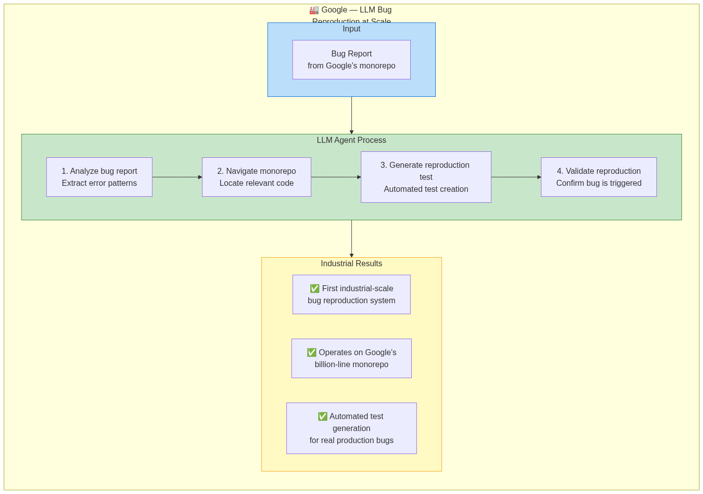

**🎨 AI 視覺化：**
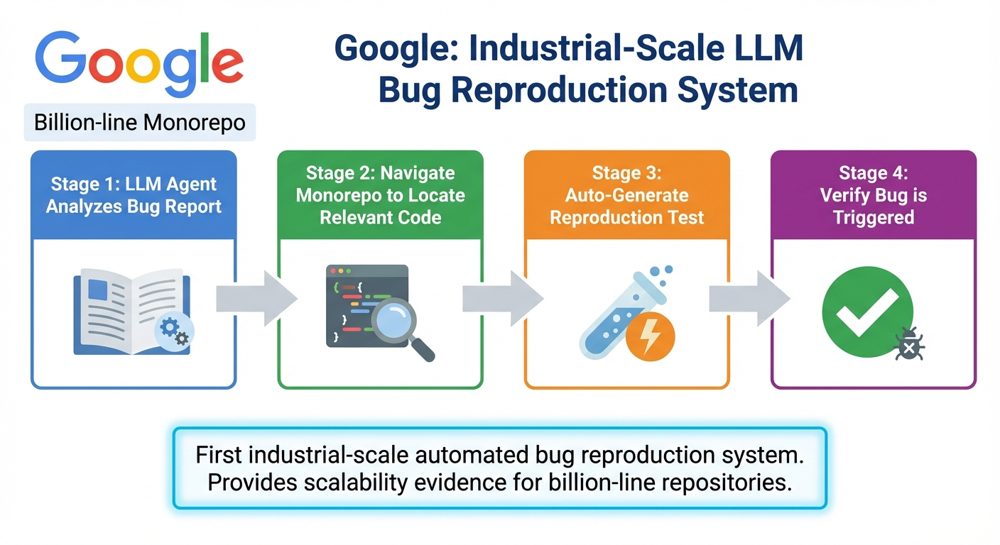

> **圖 9a：Google 工業規模 Bug 重現系統**
> Google 是唯一在**十億行級 monorepo** 上評估 LLM 自動化的企業。系統流程：LLM Agent 分析 Bug 報告 → 導航 monorepo 定位相關代碼 → 自動生成重現測試 → 驗證 Bug 是否被觸發。這是首個工業規模的自動化 Bug 重現系統，對 monorepo 規模的可擴展性提供了寶貴的實證數據。

### 4.2 字節跳動 — ContextCRBench

**📐 技術架構圖：**
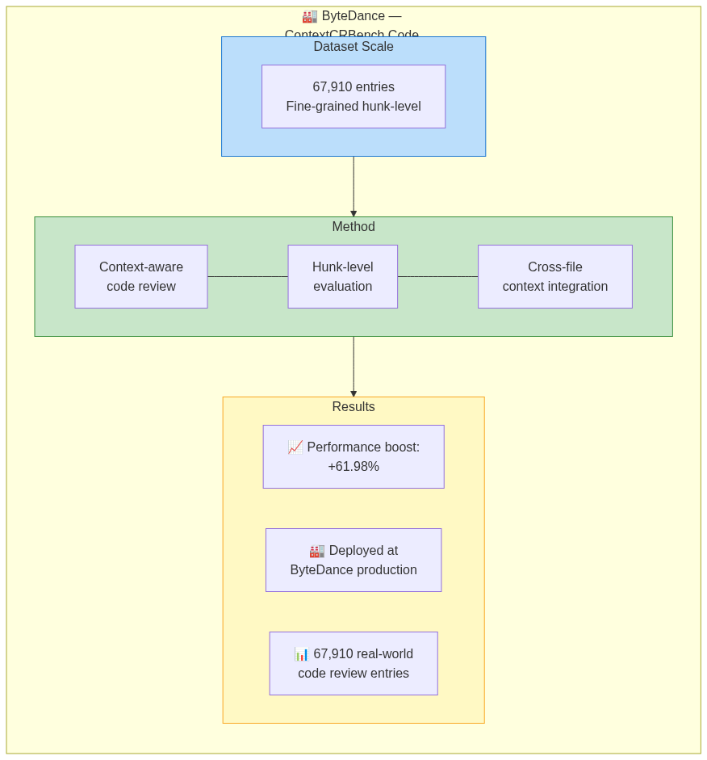

**🎨 AI 視覺化：**
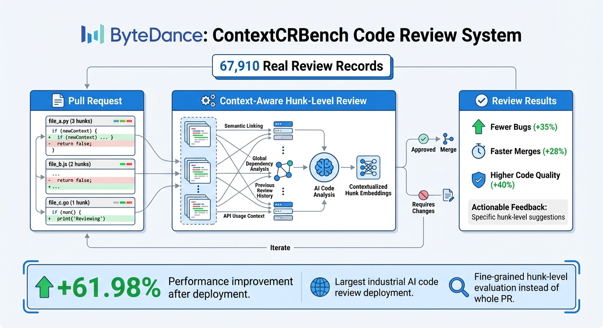

> **圖 9b：字節跳動 ContextCRBench 程式碼審查系統**
> 字節跳動在生產環境部署了上下文感知的 hunk 級程式碼審查系統，基於 67,910 條真實審查記錄。系統特點：細粒度 hunk 級評估（而非整個 PR）、跨檔案上下文整合。部署後**審查表現提升 61.98%**，是目前規模最大的工業級 AI 程式碼審查部署之一。

### 4.3 Kodezi Chronos

**📐 技術架構圖：**
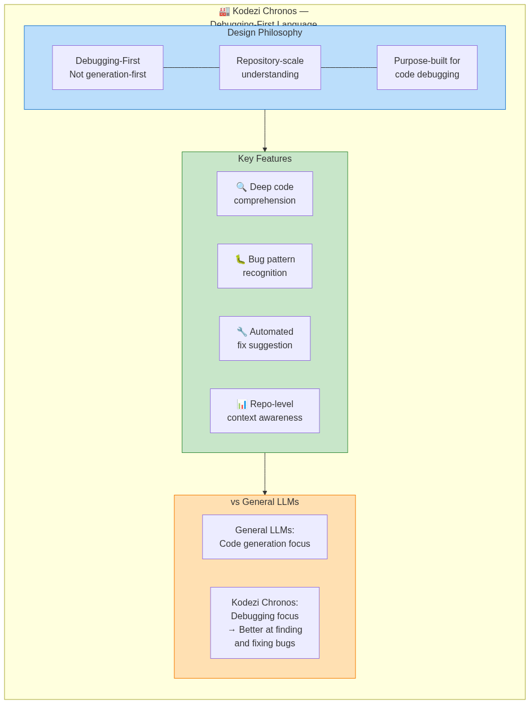

**🎨 AI 視覺化：**
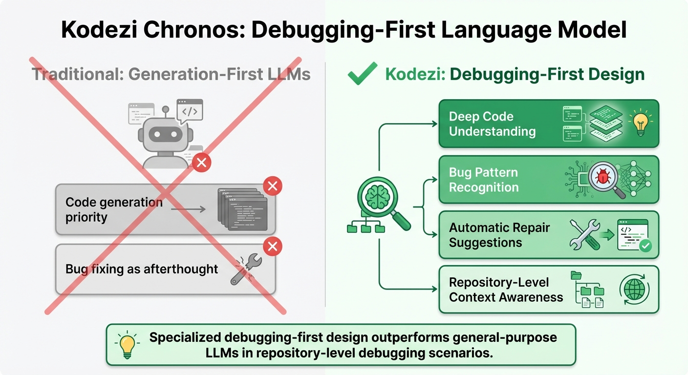

> **圖 9c：Kodezi Chronos — 除錯優先語言模型**
> Kodezi 採用**除錯優先（Debugging-First）**的獨特設計哲學，與一般 LLM 的「生成優先」理念截然不同。模型從底層就為 Bug 發現與修復優化，具備深度代碼理解、Bug 模式識別、自動修復建議和倉庫級上下文感知能力。這種專門化設計在倉庫級除錯場景中展現出優於通用 LLM 的表現。

### 4.4 騰訊 — LLM + SAST 誤報降低

**📐 技術架構圖：**
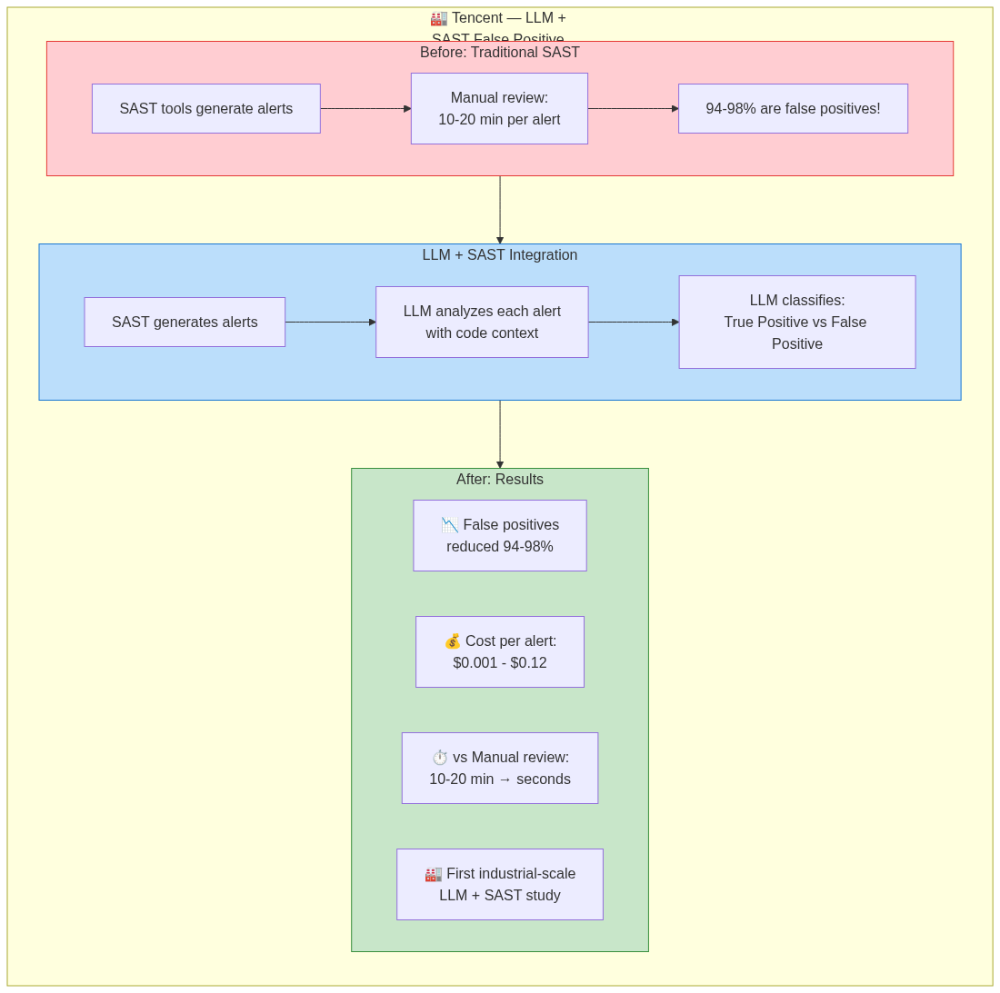

**🎨 AI 視覺化：**
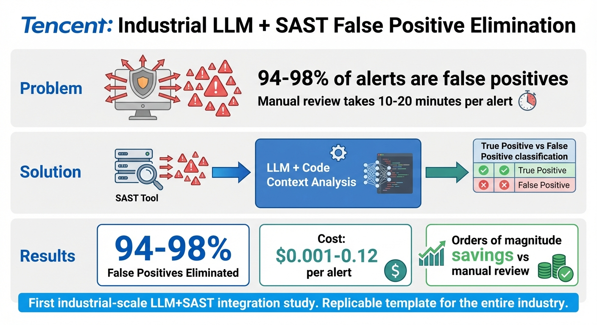

> **圖 9d：騰訊工業規模 LLM + SAST 誤報消除系統**
> 這是首個工業級 LLM + 靜態分析整合的全面實證研究。**問題**：傳統 SAST 工具產生的告警中 94-98% 是誤報，人工審查每條需 10-20 分鐘。**方案**：LLM 結合代碼上下文自動分析每條告警，判斷真陽性 vs 誤報。**結果**：誤報降低 94-98%，每條告警成本僅 $0.001-0.12，相比人工審查節省數個數量級的時間和成本。這為全行業的 SAST 工具整合提供了可複製的範本。

---

## 五、論文脈絡與技術演進

**📐 技術架構圖：**
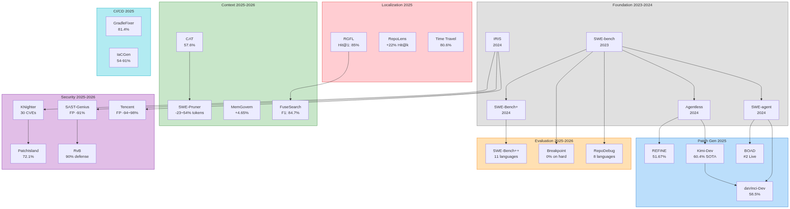

**🎨 AI 視覺化：**
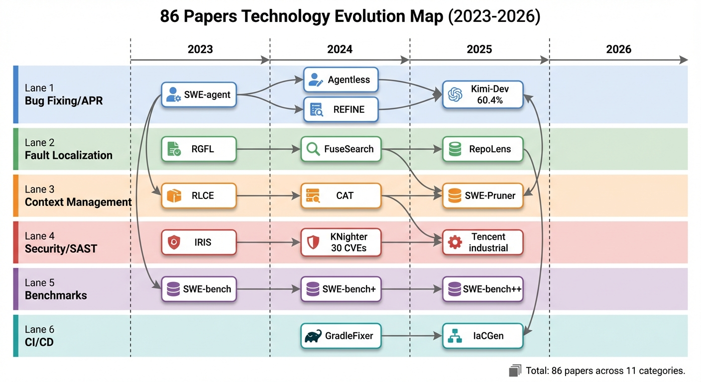

> **圖 10：86 篇論文技術演進關係圖**
> 以 2023 年 SWE-bench 為起點，技術沿六條主線演進：**定位**（紅色）——RGFL 分層推理 + FuseSearch 並行加速；**上下文**（綠色）——CAT 工具化 + SWE-Pruner 壓縮；**修復生成**（藍色）——Agentless 32% 基線 → REFINE 51.67% → Kimi-Dev 60.4% SOTA，daVinci-Dev 58.5% 和 BOAD 自動發現；**評估**（橙色）——SWE-Bench+ 揭示真實率 3.97%、SWE-Bench++ 擴展至 11 語言、Breakpoint 最難任務 0%；**安全**（紫色）——IRIS 啟發 KNighter 30 CVE、SAST-Genius -91% 誤報 → 騰訊 94-98%、PatchIsland 72.1% → RvB 90% 防禦；**CI/CD**（青色）——GradleFixer 81.4%、IaCGen 54-91%。技術從「能不能做到」向「做得多好」和「能否工業部署」快速演進。

---

## 六、現存難點與困難原因

### 難點總覽

| # | 難點 | 等級 | 短期可解？ | 關鍵相關論文 |
|---|------|------|----------|------------|
| 1 | 精確定位跨檔案 Bug | 🔴 高 | 部分（RGFL +13.6pp） | RGFL, Breakpoint, RepoLens |
| 2 | 長上下文推理退化 | 🔴 高 | 緩解（CAT, SWE-Pruner） | CAT, SWE-Pruner, CodeMEM |
| 3 | Hallucination 風險 | 🔴 高 | 緩解（SemAgent, 交叉驗證） | SWE-Bench+, SemAgent, REFINE |
| 4 | 多語言支援薄弱 | 🟡 中 | 漸進（SWE-bench++ 11 語言） | InfCode-C++, RepoDebug, SWE-bench++ |
| 5 | 測試覆蓋率不足 | 🟡 中 | 部分（SWT-Bench 翻倍） | SWT-Bench, SWE-Bench+, MAVM |
| 6 | 成本與延遲 | 🟡 中 | 部分（FuseSearch 93.6% 加速） | Agentless, FuseSearch |
| 7 | Monorepo 規模擴展 | 🔴 高 | 困難 | Google Bug Reproduction, RIG |
| 8 | 安全性（補丁安全 + APR 對抗） | 🔴 高 | 困難（exploit-based 僅 21.7%） | VulnRepairEval, SWExploit, RvB, SAST-Genius |
| 9 | 可重現性與穩定性 | 🟡 中 | 部分（確定性回退） | Self-play SWE-RL |
| 10 | SAST 誤報處理規模化 | 🟡 中 | 可行（騰訊 94-98%） | 騰訊誤報研究, IRIS, AdaTaint |
| 11 | CI/CD 構建失敗自動修復 | 🟡 中 | 部分（GradleFixer 81.4%） | GradleFixer, IaCGen, Build-bench |

### 難點 1：精確定位跨檔案 Bug 🔴 高

**現象**：即使最佳定位方法（RGFL Hit@1 85%），仍有 15% 的 Bug 無法正確定位。Breakpoint 研究顯示，涉及高呼叫圖中心性（system-level reasoning）時，SOTA 模型成功率降至 **0%**。

**根本原因**：
1. **因果鏈推理能力不足**：跨檔案 Bug 的根因與症狀分離，LLM 在超過 3-4 步的推理鏈上準確度急劇下降。
2. **Concern Tangling / Scattering**（RepoLens 揭示）：一個功能分散在多個檔案，一個檔案又混雜多個功能。
3. **缺乏全域語義理解**：LLM training data 以單文件為主，跨文件推理能力不足。
4. **Aggregation Deficit**（RepoReason 揭示）：整合寬度不足是主要認知瓶頸。

### 難點 2：長上下文推理退化 🔴 高

**現象**：CAT 研究發現，即使 200K token 窗口，Agent 推理品質在長對話中持續退化。SWE-Pruner 的存在說明：更多上下文 ≠ 更好結果。

**根本原因**：
1. **注意力稀釋效應**：Transformer softmax attention 在 token 數增加時權重下降。
2. **位置偏差（Lost in the Middle）**：LLM 傾向關注 prompt 開頭和結尾。
3. **上下文切換累積漂移**：Agent 在探索、規劃、執行間切換時累積 semantic drift。

### 難點 3：Hallucination（幻覺）風險 🔴 高

**現象**：LLM 生成看似合理但不存在的 API、錯誤的函數簽名。SWE-Bench+ 揭示 32.67% 成功案例涉及 solution leakage。RepoGenesis 最佳系統 Pass@1 僅 23.67%。

### 難點 4-11

（詳見原始報告 [FINAL-REPORT.md](FINAL-REPORT.md) 第五章完整分析）

---

## 七、實施路線圖

### 四階段遞進部署

#### 第一階段：基礎建設（Month 1-3）🟢 快速見效

| 實施內容 | 預期效果 |
|---------|---------|
| 部署 Agentless Pipeline（定位→修復→驗證） | ~32% 解決率，$0.70/issue |
| Tree-sitter AST 解析 + BM25 + 向量檢索混合索引 | 基礎程式碼索引 |
| Docker 沙盒 + 自動化測試執行 + PR 生成 | CI/CD 整合 |

#### 第二階段：定位增強（Month 3-6）🔍 打通瓶頸

| 實施內容 | 預期效果 |
|---------|---------|
| 整合 RGFL 分層推理 | Hit@1 提升至 ~85% |
| 部署 FuseSearch 並行搜索 | 加速 93.6% |
| 部署 SWE-Pruner 上下文壓縮 | 節省 23-54% token |
| RIG / LogicLens 程式碼圖譜 | +12.2% 準確率 |

#### 第三階段：Agent 升級（Month 6-9）🤖 處理複雜場景

| 實施內容 | 預期效果 |
|---------|---------|
| HyperAgent 式四代理系統 | 處理跨檔案複雜問題 |
| REFINE 補丁精煉 | 在 Fast Path 基礎再提升 ~15% |
| MemGovern 經驗記憶 | +4.65% 插件式提升 |
| SWT-Bench 式測試生成 | 精確度翻倍 |

#### 第四階段：多語言擴展、安全整合與自我進化（Month 9-12）🌐🔐 規模化

| 實施內容 | 預期效果 |
|---------|---------|
| 多語言支援（JS/TS、Java、Go） | 覆蓋主流語言 |
| Self-play SWE-RL 自我對弈訓練 | +10.4 分 |
| **SAST 整合層**（CodeQL/Semgrep + LLM 誤報過濾） | 誤報降 91-98% |
| **CI/CD 自動修復**（GradleFixer/IaCGen 思路） | 構建失敗修復 81.4% |
| **紅藍對抗測試**（RvB 思路） | 防禦成功率 90% |

### 投資回報曲線

```
投資回報
  ▲
  │                                        ┌── 第四階段
  │                               ┌────────┘   (多語言、安全整合、自進化)
  │                      ┌────────┘
  │             ┌────────┘ ← 第三階段
  │        ┌────┘           (Agent 升級)
  │   ┌────┘ ← 第二階段
  │   │       (定位增強)
  │ ──┘ ← 第一階段
  │       (Agentless MVP)
  └──────────────────────────────────────────→ 時間
   M1     M3      M6       M9       M12
```

### 安全相關里程碑

| 時間 | 里程碑 | 預期成果 | 參考 |
|------|--------|---------|------|
| M3 | 基礎 SAST 掃描整合 | 所有生成補丁經 CodeQL/Semgrep 掃描 | IRIS, SAST-Genius |
| M6 | LLM 誤報過濾上線 | SAST 告警誤報降 90%+，成本 <$0.12/告警 | 騰訊研究 |
| M9 | 安全漏洞自動修補 MVP | 已知 CVE 類型自動修補率 >50% | VulnResolver, PatchIsland |
| M10 | LLM Checker 合成 | 從歷史 commit 自動生成項目特定 checker | KNighter |
| M11 | CI/CD 構建修復整合 | 構建失敗自動修復率 >70% | GradleFixer, IaCGen |
| M12 | 紅藍對抗測試 | APR 輸出通過對抗性安全測試 | RvB, SWExploit |

---

## 八、結論與建議

### 關鍵結論

1. **倉庫級自動化代碼修改技術正在快速成熟**：從 2024 年 SWE-agent 的 12.5% 到 2025 年 Kimi-Dev 的 60.4%，一年多內 SWE-bench 解決率提升近 5 倍。但 SWE-Bench+ 的揭示（真實率 3.97%）提醒我們需謹慎看待 benchmark 數字。

2. **Agentless + Agent 混合架構是最務實的選擇**：Agentless 以極低成本處理多數簡單問題，Agent 系統負責複雜場景。Kimi-Dev 證明兩者技術可互通。

3. **基礎設施決定上限**：程式碼索引（RIG）、上下文管理（CAT/SWE-Pruner）、經驗記憶（MemGovern）等基礎設施的品質，直接決定了上層修復能力的天花板。

### Top 3 建議

| 優先級 | 建議 | 理由 |
|--------|------|------|
| 🥇 | **立即部署 Agentless Pipeline 作為 MVP** | 32% 解決率 + $0.70/issue，2-4 週可上線，快速驗證業務價值。 |
| 🥈 | **投資故障定位能力（RGFL + FuseSearch）** | 定位是整個 Pipeline 的瓶頸。RGFL 帶來 12.8% 端到端提升。 |
| 🥉 | **建立程式碼知識圖譜基礎設施** | RIG/LogicLens 提供 +12.2% 準確率和 -53.9% 完成時間。一次建設，多次複用。 |

### 預期效果（根據論文數據）

| 指標 | 預期值 | 參考來源 |
|------|--------|---------|
| Context 檢索準確率提升 | **12-18%** | AlignCoder, RIG |
| Bug 修復解決率 | **32-60%**（取決於階段） | Agentless → Kimi-Dev |
| Code Review 缺陷覆蓋率 | **+285%** vs 人工 PR | AACR-Bench |
| 開發效率（完成時間） | **-54%**（有 code graph 時） | RIG |
| 定位精度（檔案級） | **~85%** Hit@1 | RGFL |
| Token 成本節省 | **23-54%** | SWE-Pruner |
| SAST 誤報降低 | **91-98%** | SAST-Genius, 騰訊研究 |
| 安全告警處理成本 | **$0.001-0.12/告警** | 騰訊研究 |
| 安全漏洞自動修補率 | **72-75%**（已知類型） | PatchIsland, VulnResolver |
| CI/CD 構建修復率 | **75-81%** | GradleFixer, Android Diag. |

---

## 圖解索引

| 圖號 | 標題 | 對應章節 |
|------|------|---------|
| 圖 1 | 分層混合架構（Layered Hybrid Architecture） | 2.1 整體架構 |
| 圖 2 | 六階段處理流程（Six-Stage Pipeline） | 2.2 六階段處理流程 |
| 圖 3 | 故障定位技術互補關係 | 3.1 Fault Localization |
| 圖 4 | 上下文提取技術方案組合 | 3.2 Context Extraction |
| 圖 5 | Context Extraction vs Context Management 核心差異 | 3.3 Context Management |
| 圖 6 | Patch Generation 八種技術關係圖 | 3.4 Patch Generation |
| 圖 7 | 多檔案協調三大方案詳解 | 3.6 Multi-file Coordination |
| 圖 8 | 靜態分析 + LLM 強化全景圖 | 3.7 LLM + 靜態分析整合 |
| 圖 9a | Google 工業規模 Bug 重現系統 | 4.1 Google |
| 圖 9b | 字節跳動 ContextCRBench 程式碼審查 | 4.2 字節跳動 |
| 圖 9c | Kodezi Chronos 除錯優先語言模型 | 4.3 Kodezi |
| 圖 9d | 騰訊 LLM + SAST 誤報消除系統 | 4.4 騰訊 |
| 圖 10 | 86 篇論文技術演進關係圖 | 五、論文脈絡與技術演進 |

---

> 📋 **完整版報告**：本圖解版為精簡版，完整論文數據表、附錄論文索引請參見 [FINAL-REPORT.md](FINAL-REPORT.md)
>
> *本報告合併自兩份獨立研究報告（博特一號 33 篇 + 博特二號 28 篇）及補充搜索（31 篇），去重後涵蓋 86 篇 2023–2026 年 arXiv 論文。圖解使用 Mermaid 生成，渲染為 PNG 格式。具體數據應以原始論文為準。*
